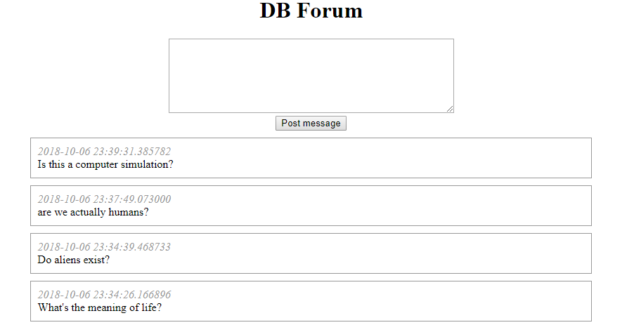

# Forum
## Background
This is a project from the free Udacity course [Intro to Relational Databases](https://www.udacity.com/course/intro-to-relational-databases--ud197) and part of an old version of the Full Stack Web Developer Nanodegree.

## Description

This is a basic forum web application.

## Goals
* Develop and deploy a Python web application with a relational database on a virtual machine (VM).
* Learn to protect database-backed web apps from common security problems, like SQL injection.

## Requirements
An installation of [Virtual Box](https://www.virtualbox.org/wiki/Downloads), [Vagrant](https://www.vagrantup.com/downloads.html) and [Python](https://www.python.org/downloads/).

## Usage

* Clone or download this project (from the parent directoy) into your computer.
* Open your prefered terminal window and navigate to the folder with the files, enter the vagrant folder and run:
`vagrant up`
* When the console is ready, run `vagrant ssh`
* Then run `http//:localhost:8000` to test the basic forum.
